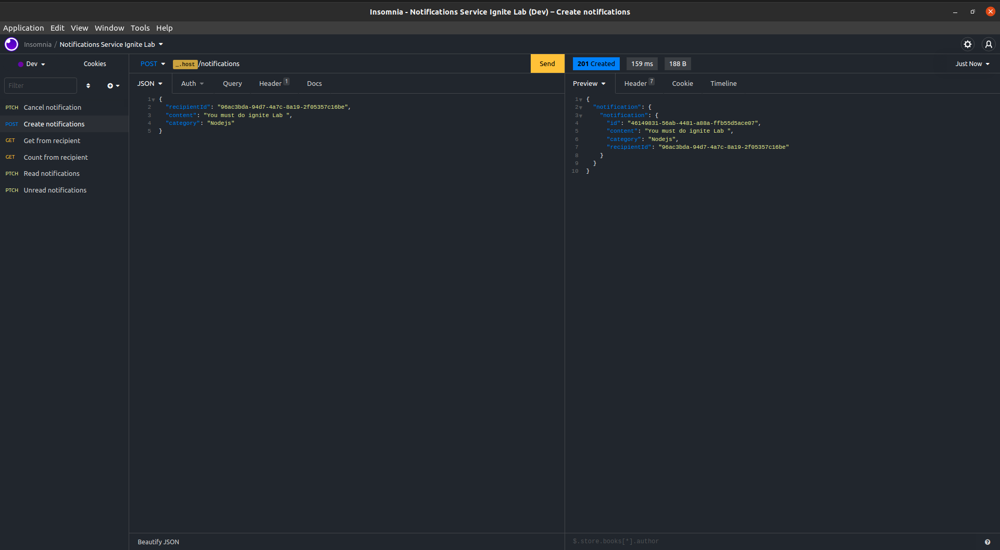

<div align="center" id="top">
<p>
  
</p>

<br>
<p align="center">
  <a href="#project">Project</a> &#xa0; | &#xa0;
  <a href="#features">Features</a> &#xa0; | &#xa0;
  <a href="#technologies">Technologies</a> &#xa0; | &#xa0;
  <a href="#requirements">Requirements</a> &#xa0; | &#xa0;
  <a href="#how to run the project">How to run the project</a> &#xa0; | &#xa0;
  <a href="#license">License</a> &#xa0; | &#xa0;
</p>

<br>
  
</div>


---

<br>

## 💻 Project

This project aims to create and manage a notifications microservice in an organized and well-structured way.
We learned the particularities of the NestJS framework integrated with Prisma such as ORM, domain, use cases, business rules, SOLID and automated tests, we connected all layers of our application, we created routes, controllers, validations.
In addition to working with the NestJS dependency injection concept, we learned the factory concept.

:fire: In the After Ignite Lab extra class, we were introduced to Asynchronous Communication using Apache Kafka.

Speechless for the quality of the event!

Developed during Rocketseat Education's Ignite Lab Classes ([@rocketseat-education](https://github.com/rocketseat-education))

## Features ##

:bellhop_bell: Create notification;\
:bellhop_bell: List notification recipient by id;\
:bellhop_bell: Count notifications from recipient id;\
:bellhop_bell: Get recipient data from notification id;\
:bellhop_bell: Cancel notification by id;\
:bellhop_bell: Mark notification as read;\
:bellhop_bell: Mark notification as unread;\
:bellhop_bell: Persist information to database;\

**Note:**
Database options to persist data <https://www.prisma.io/docs/concepts/database-connectors#overview>

## 🚀 Technologies ##

The following tools were used in this project:

- [Node.js](https://nodejs.org/)
- [Nest.js](https://nestjs.com/)
- [Jest.js](https://jestjs.io/)
- [Prisma](https://www.prisma.io/)
- [TypeScript](https://www.typescriptlang.org/)

## Requirements ##

Before starting :checkered_flag:, you need to have [Git](https://git-scm.com) and [Node](https://nodejs.org/en/) installed.

## ⌨ How to run the project ##

- Access your terminal
- Execute commands bellow:

  ```bash
  # clone project
  $ git clone git@github.com:Ca-byte/notification_service_ignite_lab.git

  # Access project folder 
  cd notifications-service
  ```

- Access [here](README-NESTJS.md) and follow steps to continue

## The server will initialize in the <http://localhost:3000>

## Routes application ##

- Create (POST): <http://localhost:3000/notifications>

```json

{
 "recipientId": "96ac3bda-94d7-4a7c-8a19-2f05357c16be",
 "content": "Cabyte, added you as a friend",
 "category": "social"
}

```

- Count from recipient (GET): <http://localhost:3000/notifications/count/from/96ac3bda-94d7-4a7c-8a19-2f05357c16be>

```json
{
  "count": 2
}
```

- Get content from recipient (GET): <http://localhost:3000/notifications/from/96ac3bda-94d7-4a7c-8a19-2f05357c16be>

```json
{
  "notifications": [
    {
      "id": "e44e7c26-8939-4d22-8834-c539ba2d0949",
      "content": "Cabyte, added you as a friend.",
      "category": "social",
      "recipientId": "96ac3bda-94d7-4a7c-8a19-2f05357c16be"
    },
    {
      "id": "e92af443-40fd-4c86-90a2-069a4cd3b9bf",
      "content": "Cabyte, added you as a friend.",
      "category": "social",
      "recipientId": "96ac3bda-94d7-4a7c-8a19-2f05357c16be"
    }
  ]}
```

- Cancel notification (PATCH): <http://localhost:3000/notifications/96ac3bda-94d7-4a7c-8a19-2f05357c16be-2f05357c16be/cancel>
- Mark as read notification (PATCH): <http://localhost:3000/notifications/96ac3bda-94d7-4a7c-8a19-2f05357c16be-2f05357c16be/read>
- Mark as unread notification (PATCH): <http://localhost:3000/notifications/96ac3bda-94d7-4a7c-8a19-2f05357c16be-2f05357c16be/unread>

## License ##

This project is under license from MIT. For more details, see the [LICENSE](LICENSE.md) file.

---


<br>

<p align="center">Developed with 💜 by Caroline Vieira</p>


<a href="#top">☝</a>

